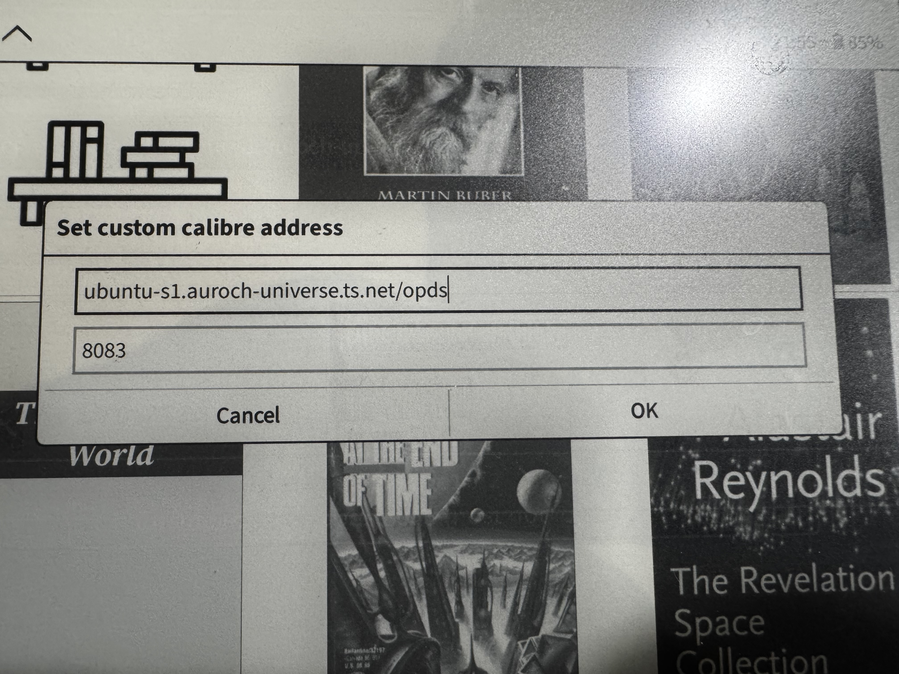

# Kobo TailScale


Put a Kobo on your tailnet, so KOReader can reach tailnet services — calibre-web,
an OPDS catalogue, ReadItEventually — from any network, not just the one at home.
A **Tailscale** entry on the home screen turns it on and off.

Built and verified on a **Kobo Elipsa (v1)** — `armv7l`, kernel 4.9.56, firmware
4.38.23697. Nothing here is Elipsa-specific beyond the preflight checks, so it
should work on any Kobo whose kernel has TUN.

Confirmed on that device: `CONFIG_TUN=y`, `/dev/net/tun` present, `/mnt/onboard`
mounted without `noexec`, and no `iptables` anywhere.

## Why this is simpler than it looks

Most e-reader Tailscale write-ups fall back to userspace networking, where
tailscaled is only a SOCKS5 proxy and every app has to be told about it. That
isn't necessary on a Kobo:

- **The Kobo kernel has `CONFIG_TUN=y`** ([confirmed for the Elipsa and Sage by
  NiLuJe](https://www.mobileread.com/forums/showthread.php?t=342174)), so this
  uses a real `tailscale0` interface. KOReader needs no proxy settings; it just
  works.
- **`tailscale` and `tailscaled` are static, CGO-free Go binaries.** The glibc
  pain in the older Kobo Sage write-up came from needing `iptables`, which this
  skips with `--netfilter-mode=off` — legitimate, because the Kobo here is a
  leaf node, not an exit node or subnet router.

## Prerequisites

A stock Kobo has no SSH server and no way to add a menu entry, so two
community add-ons do that work. Both install by copying files to the Kobo
over USB — no jailbreak, and a factory reset removes them.

- **[KOReader](https://github.com/koreader/koreader)** — the reader this is
  meant to serve, and also the only SSH server on the device (*Network →
  SSH server*, port 2222, user `root`, blank password; see
  [Reaching the device](#reaching-the-device)). Install with
  [KOReader's one-click installer](https://github.com/koreader/koreader/wiki/Installation-on-Kobo-devices)
  or via NickelMenu.
- **[NickelMenu](https://pgaskin.net/NickelMenu/)** — adds the
  **Tailscale** toggle to the Kobo home-screen menu. Optional: without it you
  start and stop Tailscale from SSH with `tailscale-ctl.sh`.
- On your computer: `ssh` (and `sshpass`, for the blank password) for the
  SSH install path; nothing for the USB path.
- A [Tailscale](https://tailscale.com) account.

## Installing

```sh
./tools/fetch-tailscale.sh --latest   # download + verify the ARM binaries
./install.sh kobo                     # over SSH; "kobo" is any ssh target
./install.sh /media/you/KOBO          # or to a USB-mounted device
```

The SSH form runs a preflight first — architecture, TUN support, free space —
and refuses rather than copying 65 MB onto a device that can't run it. Add
`--no-nickelmenu` to skip the home-screen entry.

Then log in once, from your computer:

```sh
ssh kobo /mnt/onboard/.adds/tailscale/tailscale-ctl.sh login
```

It prints a URL — in your terminal, since the command runs over SSH; nothing
appears on the Kobo's screen. Open it in a browser and approve the device.
That's the only interactive step — after it, the state is stored and the toggle
is enough.

One thing to do in the admin console while you're there: **disable key expiry**
for the Kobo (machine menu → *Disable key expiry*). Tailscale expires node keys
after 180 days by default, and when that happens the toggle stops connecting
with no visible error until you run `login` again.

To skip the browser entirely, generate an auth key in the Tailscale admin
console and pass it at install time:

```sh
./install.sh kobo --authkey tskey-auth-...
```

## Using it

On the home screen:

| Entry | What it does |
|---|---|
| **Tailscale** | Brings WiFi up, then toggles the daemon. Starting takes a few seconds. |
| **Tailscale status** | Toasts `Tailscale: up · 100.x.y.z · 7 peers`. |

The toggle asks Nickel to autoconnect WiFi first, so you don't have to turn it
on yourself — a side effect being that toggling Tailscale *off* also nudges WiFi
on. If you'd rather it never touched the radio, drop the `nickel_wifi` line from
`/mnt/onboard/.adds/nm/tailscale`.

Over SSH, `tailscale-ctl.sh` takes `start`, `stop`, `restart`, `toggle`,
`status`, `login`, `logs`, `hosts sync|clear`, and `ts <args>` for the raw
Tailscale CLI (`tailscale-ctl.sh ts ping ubuntu-s1`).

### In KOReader

Once Tailscale is up, tailnet machines are reachable **by name**, because of the
`/etc/hosts` trick described below. Each peer is written twice — full MagicDNS
name and short name:

```
100.64.0.10     myserver.tail1234.ts.net   myserver
```

**Use the full name for anything behind `tailscale serve`.** Those endpoints are
HTTPS with a certificate issued for `<host>.<tailnet>.ts.net`, so the short name
connects and then fails to validate. Verified working on the device:

```
https://myserver.tail1234.ts.net:18090   ->  200 OK
```

The short name is fine for plain-HTTP ports and for `ssh`.

Note that KOReader manages WiFi itself. If KOReader drops the WiFi, Tailscale
goes with it and reconnects when the link returns; the daemon survives.

## How it works

```
/mnt/onboard/.adds/tailscale/bin/{tailscale,tailscaled}   the binaries (65 MB)
/mnt/onboard/.adds/tailscale/tailscale-ctl.sh             all the logic
/mnt/onboard/.adds/tailscale/tailscale.conf               your settings
/mnt/onboard/.adds/tailscale/log/tailscaled.log           rotated at 1 MB
/usr/local/tailscale/tailscaled.state                     on the root filesystem
/tmp/tailscaled.sock                                      on the root filesystem
```

The split is deliberate. The binaries are far too big for the ~300 MB root
filesystem, so they live on the user partition. But that partition is vfat,
which **cannot hold the 0600 the state file needs and cannot host a unix socket
at all** — so the state file (a few KB) and the control socket go on the root
filesystem. Putting either on `/mnt/onboard` breaks tailscaled.

Three more things the control script handles:

- **`/dev/net/tun` is created on every start.** `/dev` is devtmpfs and is rebuilt
  at each boot, so this can't be a one-time install step.
- **DNS is left alone.** The Kobo has no DNS manager, so Tailscale would simply
  overwrite `/etc/resolv.conf` — which WiFi reassociation then overwrites back.
  So `--accept-dns=false`, and MagicDNS is replaced by a marker-delimited block
  of tailnet peers written into `/etc/hosts` on start and removed on stop. That
  block is rewritten idempotently, never appended to.
- **`--netfilter-mode=off` goes on `tailscale up`, not on `tailscaled`.** The
  daemon flag was removed upstream; passing it there makes tailscaled exit with
  a usage dump. It is also not optional: the Kobo ships **no `iptables` binary
  at all**, so any other mode fails once Tailscale tries to install rules.
- **The daemon is detached** with `setsid` and given a small `renice` boost, so
  Nickel doesn't reap or starve it.

## Troubleshooting

| Symptom | Cause |
|---|---|
| `Tailscale: no /dev/net/tun` | `mknod` failed — not running as root. |
| `Tailscale: needs login` | Never authenticated; run `tailscale-ctl.sh login`. |
| Toggle does nothing | `tailscale-ctl.sh logs` — the daemon log is the truth. |
| Peers ping but names don't resolve | `tailscale-ctl.sh hosts sync` after a new machine joins the tailnet. |
| Works at home, not on cellular | Genuine connectivity issue, not this script — check the peer is online. |

### Not a Tailscale problem: "Set custom calibre address"

Worth knowing, because it looks like a network failure and isn't. KOReader's
**Calibre Wireless** feature (*"Set custom calibre address"*, a host box and a
separate port box) talks to the **desktop** Calibre app's device server — a
binary protocol on port 9090. It cannot talk to calibre-web, so no address
entered there will work, and putting a path in the host box yields
`host not found` for a mangled hostname:

<p align="center">
  
  
</p>

For calibre-web, use the **OPDS catalog** browser instead — one URL field, no
port box — with the full MagicDNS name:
`https://<host>.<tailnet>.ts.net:8083/opds`.

### Reaching the device

The Kobo has no SSH daemon of its own. What answers is **KOReader's** server,
started from KOReader → *Network* → *SSH server*: port **2222**, user `root`,
blank password. Plain `ssh` refuses a blank password, so:

```sh
sshpass -p '' ssh -o PreferredAuthentications=password -o PubkeyAuthentication=no \
    -p 2222 root@kobo-elipsa.<tailnet>.ts.net
```

Once Tailscale is running you can use the tailnet name instead of the LAN
address, which is the whole point of this.

Uninstall by deleting `/mnt/onboard/.adds/tailscale`, `/mnt/onboard/.adds/nm/tailscale`
and `/usr/local/tailscale`, after running `tailscale-ctl.sh stop` so the
`/etc/hosts` block is removed.

## Out of scope

Using the Kobo as an **exit-node client** (routing all its traffic through, say,
the Mullvad gateway) is not supported here: that needs working `iptables` on the
device, which stock Kobo firmware does not have.

## Credits

Prior art that saved a lot of guessing:
[videah/kobo-tailscale](https://github.com/videah/kobo-tailscale),
[Dylan Staley's Kobo Sage write-up](https://dstaley.com/posts/tailscale-on-kobo-sage/),
and NiLuJe's kernel-config answer on
[MobileRead](https://www.mobileread.com/forums/showthread.php?t=342174).
